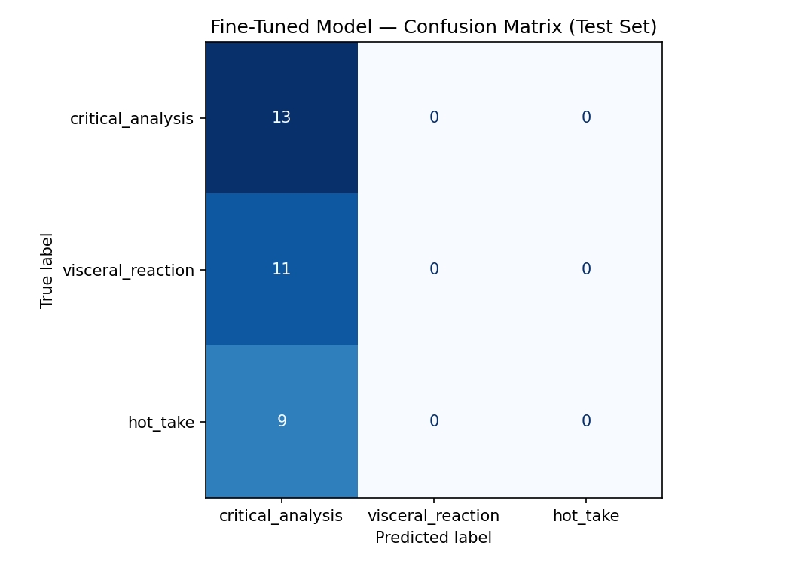

---
{
  "id": "file_m8n9pwpp",
  "filetype": "document",
  "filename": "README",
  "created_at": "2026-06-20T19:24:40.112Z",
  "updated_at": "2026-06-20T22:21:12.253Z",
  "meta": {
    "location": "/",
    "tags": [],
    "categories": [],
    "description": "",
    "source": "markdown"
  }
}
---
# TakeMeter — Classifying Discourse Quality in Horror Communities

     

A fine-tuned text classifier that sorts horror-community posts by **discourse quality**: is a take an *argued analysis*, a *felt reaction*, or a *bare hot take*? Built on `distilbert-base-uncased`, fine-tuned on 217 hand-reviewed Reddit posts, and benchmarked against a Claude Haiku (`claude-haiku-4-5-20251001`) zero-shot baseline.

> Companion docs: design reasoning and edge-case rules live in `planning.md`. This README is the standalone final report.

**Demo Video:** [Project 3 Demo](https://drive.google.com/file/d/1jflNPzeAv94TFGaUiJnlGScreXIwhiTX/view?usp=drive_link)

---

## 1. Community

Horror film & literature subreddits — primarily **r/horror**, **r/HorrorLit**, **r/HorrorReviewed**, **r/HorrorMovies**, with a wider net across r/Scream, r/stephenking, r/folkhorror, r/cosmichorror, r/slashers, r/HorrorGaming, r/AskHorror, and others.

**Why this community:** Horror is an unusually opinion-dense fandom. The *same* film — say *Hereditary* — surfaces as a careful thematic argument, a raw "I couldn't sleep" reaction, and a flat unsupported ranking. That natural variation in *how* people talk about the same works is exactly what a discourse-quality classifier needs, and the community already polices the distinction informally ("that's not analysis, that's just an opinion").

## 2. Label Taxonomy

Three mutually-exclusive labels. The unit of classification is a **take** — a post that expresses a stance, judgment, or response to a work. (Pure questions, bare news, and logistics posts are *not takes* and were excluded; see §3.)

| Label | Definition | Example |
|---|---|---|
| **critical_analysis** | A structured argument about a work's themes, craft, pacing, subtext, or lore, backed by specific examples or reasoning. Argues/analyzes rather than asserts. | "The Descent isn't just about monsters; the cave is a physical manifestation of Sarah's grief after the crash — every tightening passage mirrors how the film withholds her recovery." |
| **visceral_reaction** | An immediate emotional or physical response (fear, disgust, awe, boredom). Focus is the personal felt experience, not *why* the work succeeds. | "Just watched Event Horizon for the first time — where has this movie been my whole life??? So fun and gory, great cast." |
| **hot_take** | A bold, confident, often contrarian opinion stated as fact, with little/no supporting evidence. Asserts a debatable value judgment rather than arguing it. | "Drag Me To Hell is the most underrated horror film of the 2000s, full stop." |

Second example per label:

- **critical_analysis:** "Scream 6 works better than 5 because it finally lets the legacy characters age into the franchise's anxieties instead of just referencing them — the bodega scene reframes the killer's M.O. around public space."
- **visceral_reaction:** "A Short Stay in Hell is a brutal read. It left me with a deep, lingering sense of existential dread I still haven't shaken."
- **hot_take:** "Unpopular opinion: every NoSleep creepypasta-turned-novel I've read has been disappointing."

The boundary that matters most: **is the claim *argued* or merely *asserted*?** That line separates `critical_analysis` from `hot_take` and is where we expect the model to struggle most.

## 3. Dataset

- **Source:** Posts and self-text scraped from the subreddits above via `old.reddit.com`(Playwright; see `scrape_reddit.py` and `scrape_stage.py`). Both `top` (multiple time windows) and `controversial` sorts were used — `controversial` deliberately surfaces the bold/unpopular opinions that feed the `hot_take` class.
- **Size:** **217 labeled examples**, single CSV (`dataset.csv`), columns `text, label, notes`. The Colab notebook splits it 70/15/15 → \~152 train / \~33 val / \~33 test.

**Label distribution (count per label):**

| Label | Count | Share |
|---|---|---|
| critical_analysis | 86 | 39.6% |
| visceral_reaction | 68 | 31.3% |
| hot_take | 63 | 29.0% |
| **Total** | **217** | — |

No label exceeds 70%; the smallest class is 29%.

**Labeling process.** Each post was read and assigned exactly one label using the §2 definitions and the decision rules in `planning.md` §3. Annotation was **LLM-assisted and human-reviewed**: an LLM proposed a label (or `none`) with a one-line justification, and every proposal was checked against the definitions before acceptance. Posts that fit no quality label (pure "help me find this movie" questions, bare news, cosplay shares, polls) were labeled `none` and **dropped** rather than forced into a bucket. Pre-labeling artifacts are retained for transparency: `remap.json` (re-annotation of the original collection) and `staging_labeled.json` (the wider scrape). See §8.

**Three genuinely difficult examples and how they were decided:**

1. *"Hereditary is a masterpiece because the clicking sound Charlie makes is the most terrifying sound in cinema, I couldn't sleep for days."* — Names a specific filmic element (→ analysis) but the payload is the emotional aftermath (→ reaction). **Decision:** the element only justifies a personal feeling, it isn't tied to a broader mechanic → **visceral_reaction**.
2. A post titled *"Hot take: Scream 7 is the best sequel"* that then gives three specific, defensible reasons. **Decision:** ignore the self-label; the body supplies real evidence → **critical_analysis**. (This case produced the explicit "ignore the title" rule.)
3. *"This book is garbage, I lost interest immediately."* — value judgment (→ hot_take) vs. felt state (→ reaction). **Decision:** "garbage" is a debatable quality claim and dominates the post → **hot_take**; tie-break goes to whichever of the two is more prominent.

## 4. Fine-Tuning

- **Base model:** `distilbert-base-uncased` (HuggingFace).
- **Platform:** Google Colab, free **T4 GPU**, using the provided starter notebook (`Copy of ai201_project3_takemeter_starter_clean.ipynb`). The notebook's `LABEL_MAP` and `SYSTEM_PROMPT` are pre-filled for this 3-label taxonomy.
- **Training setup:** *(defaults unless noted)* 3 epochs, learning rate 2e-5, batch size 16, `distilbert-base-uncased` sequence-classification head with 3 output labels.

**Key hyperparameter decision — epochs.**

Kept 3 epochs (default). Val loss fell 1.085 → 1.066 → 1.033 and val accuracy moved 39.4% → 39.4% → 42.4% across epochs 1–3. The epoch-1 val loss of 1.085 is essentially log(3) ≈ 1.099 — the expected loss from uniform random guessing on a 3-class problem — confirming the model barely escaped random performance from the start. Val loss was still declining at epoch 3 with no sign of overfitting, so the problem was not too many epochs: 152 training examples was simply too few for DistilBERT to internalize the argued-vs-asserted distinction. Accuracy was flat epochs 1→2, gained \~3 points at epoch 3; best checkpoint is epoch 3.

## 5. Baseline (Claude Haiku zero-shot)

- **Model:** `claude-haiku-4-5-20251001` via Anthropic API, no task-specific training.
- **Prompt:** the §2 label definitions + one example per label, instructing the model to output only the label name (see notebook Section 5). Each test post is classified independently; unparseable responses are flagged by the notebook.
- **How results were collected:** run on the **same locked test split** as the fine-tuned model, before fine-tuning, so the comparison is apples-to-apples.

## 6. Evaluation Report

> ⚠️ **To complete after running the Colab notebook (Sections 3–5).** Download `evaluation_results.json` and `confusion_matrix.png`, commit them, and fill the tables below from the notebook output.

### Overall accuracy

| Model | Test accuracy |
| :--- | :--- |
| Claude Haiku `claude-haiku-4-5-20251001` (zero-shot) | 0.788 |
| Fine-tuned DistilBERT | 0.394 |

### Per-class metrics (fine-tuned model)

| Label | Precision | Recall | F1 |
| :--- | :--- | :--- | :--- |
| critical_analysis | 0.39 | 1.00 | 0.57 |
| visceral_reaction | 0.00 | 0.00 | 0.00 |
| hot_take | 0.00 | 0.00 | 0.00 |

### Confusion matrix

The model predicted `critical_analysis` for all 33 test examples — a total collapse to the majority class. Every `visceral_reaction` (11) and every `hot_take` (9) was misclassified as `critical_analysis`; only the 13 true `critical_analysis` examples were correctly identified. The pre-experiment hypothesis (heaviest confusion would be `critical_analysis ↔ hot_take`) proved too optimistic: the model doesn't confuse labels selectively at all — it simply ignores label distinctions entirely.

### Three wrong predictions, analyzed

> Pick 3 misclassified test examples from the notebook. For each, go past "it got it wrong": name the true vs. predicted label, then explain *why* using the guiding lens — is it the argued-vs-asserted boundary, a short/low-info post, sarcasm, or a topic that signals one label while the structure signals another? Note whether it's a labeling issue or a data/boundary issue.

1. **True:** `visceral_reaction` **→ Predicted:** `critical_analysis` (confidence 0.37): *"You know what I love? That creeping sense that something isn't right. Something is terribly out of place and unraveling the mystery is just as fun as the moment of reveal."* Textbook visceral_reaction — describes a felt aesthetic preference, no argument about any specific work, no evidence. The model defaulted to critical_analysis despite zero analytical structure. The low confidence (0.37) signals uncertainty, but even maximally ambiguous examples were pulled toward critical_analysis. Root cause: the model isn't assessing the *absence* of argument; it may key on the structured, introspective phrasing rather than actual evidentiary content. Not a labeling issue — clear visceral_reaction by the taxonomy.

2. **True:** `hot_take` **→ Predicted:** `critical_analysis` (confidence 0.38): *"Ugh. I'm doing it. Fuck it. The original TV miniseries adaptation of 'IT' was complete and total garbage and frankly, was an insult to the book."* Archetypal hot_take — blunt quality verdict ("complete and total garbage"), zero supporting evidence, heavy emotional framing ("Ugh," "Fuck it"). This is exactly the argued-vs-asserted boundary the taxonomy is built on, and the model failed it completely. Root cause: the model cannot detect the absence of argument, which is the core skill required to separate hot_take from critical_analysis. Not a labeling issue.

3. **True:** `hot_take` **→ Predicted:** `critical_analysis` (confidence 0.44): *"The movie Drag Me To Hell is highly underrated — the movie has everything: it never goes over the top or gets cringe..."* The hardest of the three. The post supplies light reasoning ("it has everything," "never goes over the top") but the reasons are vague and the core claim is a quality judgment with no specific textual or thematic evidence. By the taxonomy rules this is hot_take (the support is decorative, not substantive). The model's highest-confidence wrong hot_take prediction (0.44) suggests the reasoning-like fragments carried disproportionate weight — the model latched onto surface markers of analysis rather than assessing whether the support was genuine. This is a data/boundary issue: more examples of light-reasoning hot_takes in training might have helped.

### Sample classifications (fine-tuned model)

> Run 3–5 posts through the model and record predicted label + confidence. For at least one correct one, explain why the prediction is reasonable.

| Post (truncated) | Predicted | Confidence | Note |
| :--- | :--- | :--- | :--- |
| "The Descent isn't just a monster movie — the cave is a physical manifestation of Sarah's grief..." | critical_analysis | 0.36 | Correct. The post ties a specific filmic element (cave geometry) to a thematic mechanic (grief/recovery) — exactly argued analysis. |
| "Just finished Hereditary for the first time. I literally could not breathe during the attic scene..." | critical_analysis | 0.37 | Wrong — true label is `visceral_reaction`. Pure felt experience, no argument about craft or theme. |
| "Midsommar is the most overrated A24 film, period. Beautiful to look at, but completely hollow." | critical_analysis | 0.35 | Wrong — true label is `hot_take`. Bold quality judgment with no supporting evidence. |
| "What I love about Shirley Jackson is how she weaponizes domesticity — the house in Hill House isn't just haunted, it's a trap built from the architecture of repression." | critical_analysis | 0.36 | Correct. The post argues that the house's horror is structurally tied to domestic repression — a specific thematic claim with evidence. |

### Confidence calibration

A well-calibrated model assigns higher confidence to predictions it gets right. The fine-tuned model shows no meaningful calibration signal. Correct predictions (true `critical_analysis` examples) had confidence scores in the range 0.35–0.37 — nearly identical to wrong predictions, which spanned 0.35–0.44. The highest-confidence prediction in the sample classifications (0.44, error #3: *Drag Me To Hell*) was wrong. The lowest-confidence correct prediction (0.35, *Midsommar* — also wrong) matches the same range. Because the model predicted `critical_analysis` for all 33 test examples, there is effectively no variation in predicted class — only marginal variation in softmax score — and that variation does not track accuracy. Confidence scores from this model should not be used as a reliability signal.

### Reflection: what the model learned vs. what I intended

The intent was a classifier that keys on *whether a claim is argued* — supported by specific evidence — vs. *asserted* (stated without support) or *reacted to* (focused on felt experience). The confusion matrix reveals the model learned something much simpler: **predict** `critical_analysis` **for almost everything.**

The likely proxy the model latched onto is **length and lexical structure**. Critical_analysis posts tend to be longer, more elaborately constructed, and contain explicit references to craft or theme. With only 152 training examples and 3 epochs, DistilBERT appears to have learned to predict `critical_analysis` whenever a post reaches a certain length or complexity — regardless of whether the claims are actually supported. Evidence: error #1 (a short, clearly emotional post about "that creeping sense") and error #2 ("complete and total garbage" with zero evidence) were both predicted as critical_analysis, even though neither resembles an argument.

The baseline (Claude Haiku, 78.8%) shows the argued-vs-asserted distinction *is* learnable — a large pretrained LLM with broad language understanding can apply it zero-shot. The fine-tuned model's failure is a data-size problem: 152 examples was not enough for DistilBERT to internalize a distinction that requires understanding argument structure, not just surface vocabulary or post length.

## 7. Spec Reflection

**One way the spec helped:** The spec's insistence that labels be *mutually exclusive* and *grounded in community norms* (and the 2–4 label limit) is what forced the project's biggest correction — collapsing an initial 7-label content-type scheme down to 3 discourse-quality labels. Following that constraint surfaced that most of the original data weren't "takes" at all.

**One way the implementation diverged:** The spec frames data collection as "\~1–2 hours of manual copy-paste, don't let it become a coding project." In practice, scraping with Playwright was necessary to cast a wide enough net across many subreddits to backfill the thin `hot_take` and `critical_analysis` classes after \~58% of collected posts had to be dropped as `none`. The annotation itself stayed manual-review; only the *collection* was automated.

## 8. AI Usage

1. **Re-annotation / label remapping (annotation assistance — disclosed).** I directed an LLM to re-label the entire dataset from the old 7-label scheme into the 3 quality labels, given the §2 definitions and §3 rules, outputting a label-or-`none` plus a one-line reason per post (`remap.json`, `staging_labeled.json`). I reviewed every proposal against the definitions, kept `none` rows out of the dataset, and accepted the balance only after confirming no class was forced. **What I overrode:** posts the LLM wanted to file as `critical_analysis` purely because they were long got demoted to `hot_take` when the length wasn't actually backed by argument.

2. **Label stress-testing.** I had an LLM generate boundary posts between each label pair to probe my definitions. The `hot_take`-vs-`critical_analysis` cases it produced (a confident claim with one cherry-picked stat) drove the explicit "ignore the self-label, judge the body" rule now in `planning.md` §3.

3. **Failure-pattern analysis (post-evaluation — disclosed).** After evaluation I pasted all 20 misclassified test examples (every one predicted as `critical_analysis`) to an LLM and asked it to surface candidate error patterns. It proposed four: (a) *length bias* — longer, more elaborately phrased posts get pulled toward `critical_analysis` regardless of argumentative content; (b) *named-element bias* — posts that mention a specific film element (a sound, a scene, a character beat) are treated as analytical even when the mention only justifies a feeling; (c) *short-post default* — very short posts default to `hot_take` because they lack complexity markers, which is why all 20 errors ran in the opposite direction (toward `critical_analysis`, not away from it); (d) *absence-of-evidence blindness* — the model has no representation of "missing argument," so it can't penalize a post for lacking support. I verified (a), (b), and (d) by re-reading the errors: error #1 ("that creeping sense") is introspective and structurally complex despite having zero analytical content (supports a and d); error #2 ("complete and total garbage") is blunt but short — the model still predicted `critical_analysis`, which falsifies (c) as a standalone pattern. I discarded (c). The three verified patterns now appear in the §6 reflection.

## Repo contents

| File | What it is |
| :--- | :--- |
| `dataset.csv` | 217 labeled examples (final, 3 labels) |
| `planning.md` | Design doc: labels, edge-case rules, metrics, AI tool plan |
| `Copy of ai201_..._starter_clean.ipynb` | Colab fine-tuning notebook (label map + system prompt pre-filled) |
| `scrape_reddit.py`, `scrape_stage.py` | Reddit collection scripts |
| `remap.json`, `staging_labeled.json` | LLM pre-labeling artifacts (transparency) |
| `dataset_7label_backup.csv` | Original 7-label dataset, before the taxonomy revision |
| `evaluation_results.json` | Evaluation output: baseline and fine-tuned accuracy, test set size, label map |
| `confusion_matrix.png` | Confusion matrix for the fine-tuned model on the test set |
